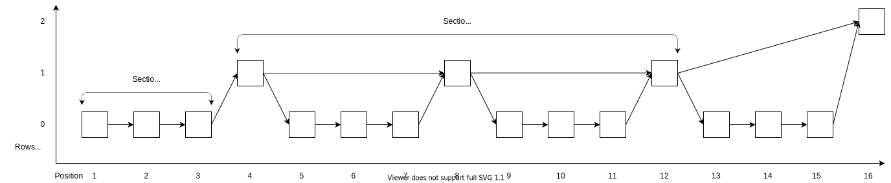
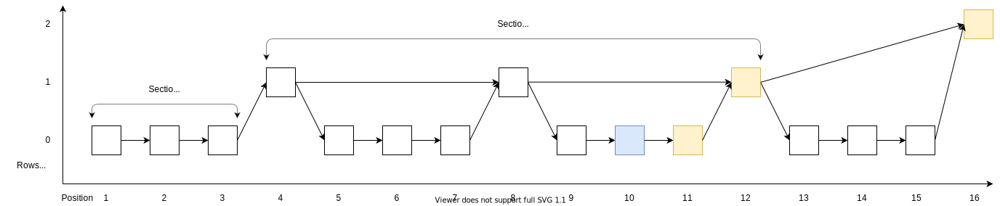
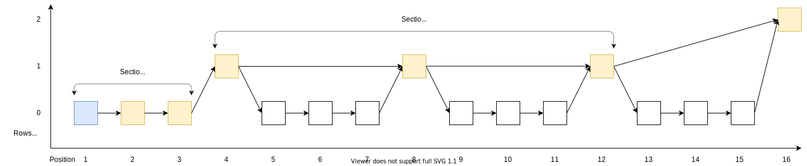

# Tangleproof

Library to send transactions and create a proof object for them which can be used at any later time to prove that a transaction exists in the Tangle (also called proof of inclusion).

Steps to verify a created proof:

1. Calculate message id and check if it's part of the indexation payload of the first transaction
2. Check for each transaction if one output is used as input in the next transaction
3. Check if latest output is known by a node

Rename `.env.example` to `.env` and replace the mnemonic with your own.

Run example with `cargo run --release`

The first time it runs you need to send 10 Mi to the first address, you can get testnet iotas from https://faucet.testnet.chrysalis2.com/.

For a proof to be valid one output of a transaction always needs to be used as input in the next transaction and the latest output needs to be known by a node. No other transaction could have created this output, because the hash would be different then, therefore it needs to be valid.
The output is not available before the transaction is confirmed, so it can take a few seconds before a new proof is valid and if new proof transactions are created a new proof has to be requested after a while because the outputs for an older proof will be spent and forgotten.

If the createion of a proof for a message is requested the message will be requested from the node and stored locally in the db. The message id will then be included in an indexation payload in one transaction of the structure below.

The path for a message in transaction 10 would consist of the yellow transactions:

Longest proof path `(rows + 1) * section_length` (without more than section length txs before a new row starts):

Moving the iotas with another wallet will destroy the proofs because the outputs will then no longer be the end of transaction chain from a proof and deleted from the nodes.
